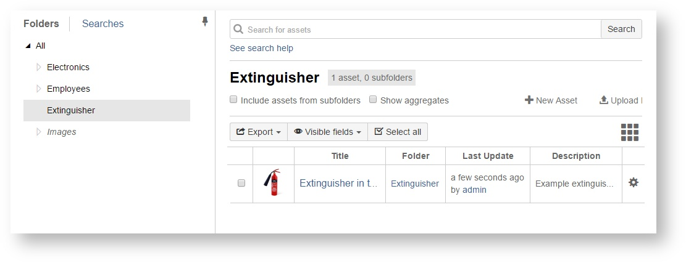
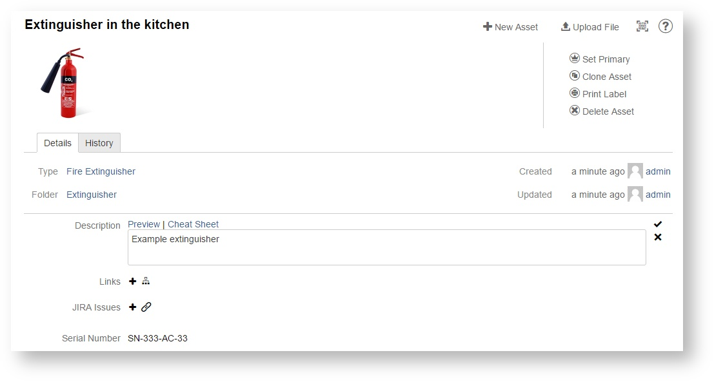
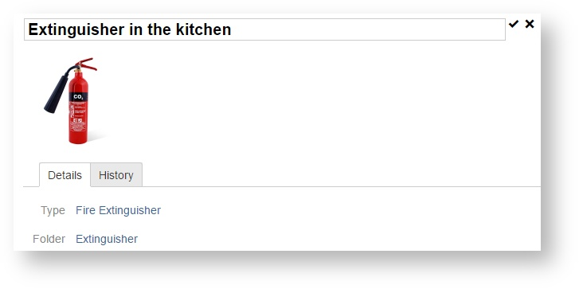
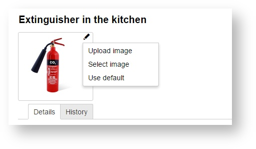

# Editing an asset

To edit an asset, find it in its folder, or by searching, and click its title.

### Asset page

When you click on an asset, the asset's page opens, where you can edit any of the asset fields, by simply clicking on them and changing inline:

To change asset title, you do the same thing - click on the title and edit it.

For asset image, clicking on the image itself zooms the image to full page. To change the image, click on the pencil icon which appears after you place the pointer over the image.

### Editing assets in bulk

It is also possible to edit asset fields in bulk - setting a field to the same value in multiple assets in one go. To do this, select some assets and pick the "Edit field" menu option:

Then, pick the field to edit, set its value and click "Save". That's it - the value is changed in all selected assets.

### "My assets" dashboard gadget

Asset Tracker lets you view assets and add issues for assets that belong to the user, or assets resulting from a query.

To add this gadget, open dashboard gadgets list in Jira and find the "Asset Tracker Assets" gadget:

