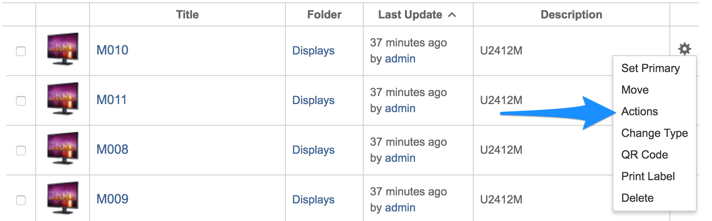
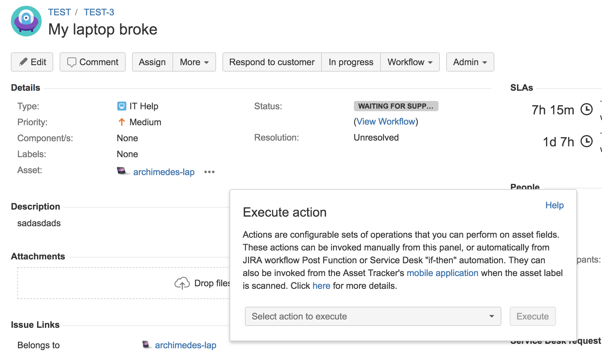

# Invoking actions manually

After you [define the action](defining-operation-sequences.md), you can invoke it manually from quite a few places

### In asset browser

1. From the "cog" menu of the individual asset \(action is applied to this asset\):

2. from the "Actions" menu for selected assets \(action is applied to all selected assets\):

In both cases, this dialog shows up

In the dialog, find the action that you want to invoke, either in "_My actions" _or _"Public actions" _tab, and click "_Execute_".

### On asset page

On the asset page, click the "_Actions" _button in the top-right corner of the page:

The same dialog as the one described in the previous section is shown and the executed action is applied to the currently shown asset. After action is executed, the page is automatically refreshed.

### On issue page

If you have an asset associated with an issue using [Asset custom field](../../integrations/jira-asset-field/), you can execute the action by clicking the "..." button next to the asset name:

This opens the "simplified" action dialog:

In this dialog, first select the action you want and then click the "_Execute"_ button.

