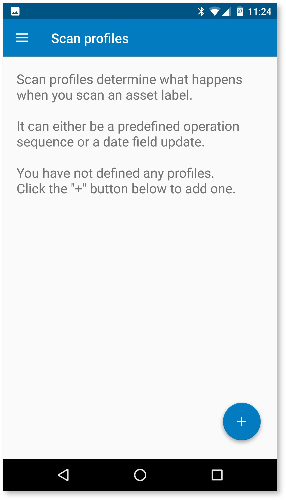
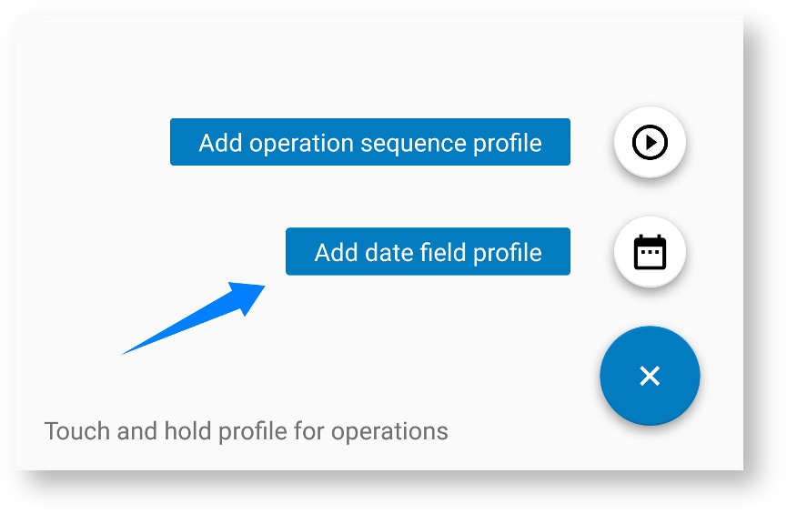
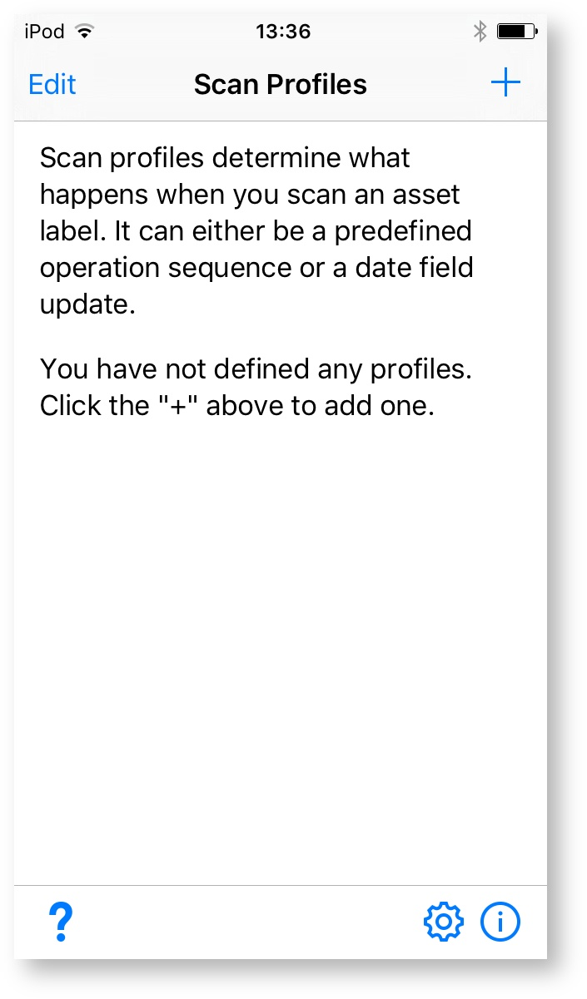
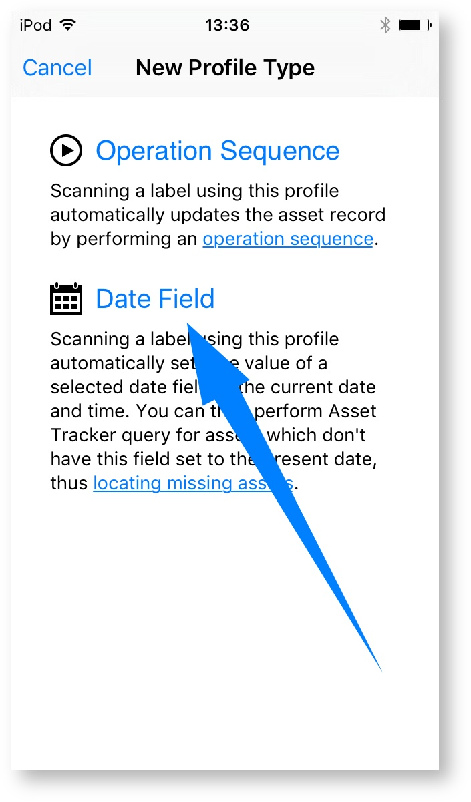

# How to perform inventory checks

### Introduction

Inventory check is a process of locating your assets and recording their presence in Asset Tracker. This lets you identify missing or misplaced assets.

To simplify inventory checks, Asset Tracker provides [mobile application](https://confluence.spartez.com/display/AT4J/Label+Scanners) which lets you quickly scan [asset labels](how-to-print-labels-for-assets.md). Scanning the label automatically sets the value of a selected date field to the current date and time. You can then perform Asset Tracker query for assets which don't have this field set to the present date, thus locating missing assets.

### Setting up inventory check

To set up inventory checks, open the "_Inventory Checks"_ administration page, from which you can set up the required date field:


### Running inventory check

To actually run the inventory check, you need the [Android or iPhone application](https://confluence.spartez.com/display/AT4J/Label+Scanners). The application is simple to use. It lets you define "Scan Profiles", which determine your Jira URL and credentials, and the asset field to set when the QR code is scanned. To define the profile, pick the "_Add date field profile"_ menu entry after clicking the "+" button \(you can also add the profile that executes [operation sequence](https://confluence.spartez.com/display/AT4J/Invoking+operation+sequences+by+scanning+asset+label) from that menu\):




|  |  |
| --- |



|  |  |
| --- |



Once you set up the profile, you can press the "Scan" button to begin inventory scanning:













Scanning is fully automated - when the QR code is identified, the date field is automatically set in the asset record in Asset Tracker. 













Additionally, if you forgot to add the configured date field to scanned asset type, the application will let you add it automatically. This operation requires [administrative permissions](how-to-control-access-to-assets.md) in Asset Tracker.


If the application adds the field to asset type, you will; have to manually reindex you asset database in Jira. This is done in the Asset Tracker administration, "Indexing" section.




### Identify missing assets

After you have finished scanning your asset QR code labels, you can go to Asset Tracker and [search](https://confluence.spartez.com/display/AT4J/Searching) for assets that have not been scanned \(and therefore can be assumed missing or misplaced\).

For example, if you are using a [field](https://confluence.spartez.com/display/AT4J/Defining+an+asset+field) with the `last.check` name, you can run the following Asset Tracker query:

```text
last.check < -1d OR last.check IS EMPTY
```

This query will return all assets, which have the `last.check` field added to their asset type and in which the field is either not set, or is set to a date earlier than 1 day ago. This assumes that your inventory check took less than a day, modify the query accordingly if it took longer. 

