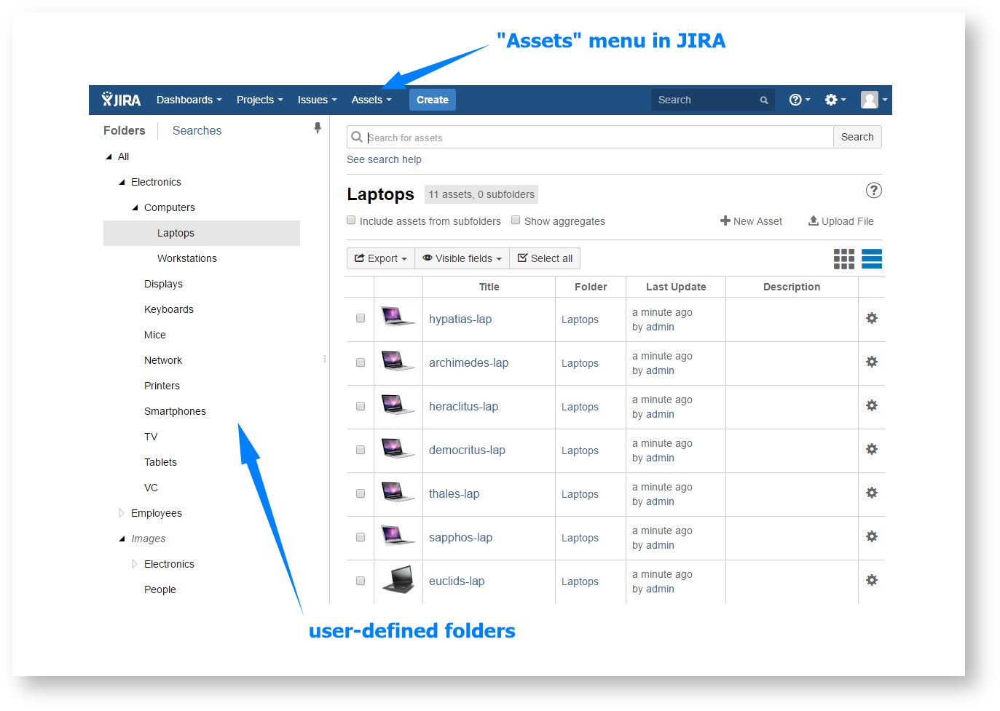

# Basic terms


During this introduction we will use sample data delivered with Asset Tracker. You can import them in Asset Tracker Administration in "Import/Export" section.


Every single inventory asset stored in Asset Tracker is called an **asset**. It may be a mouse, keyboard, chair or any other asset that you would like to manage. 

The screen below contains sample list of assets. Each asset has some data associated with them like name, value, serial number, manufacturer and icon.

These data for each asset are stored in fields \(called **asset fields** in Asset Tracker\). Of course different **asset types** like displays and employees has different fields \(for employee it could be position, salary etc.\).

Asset Tracker has to deal with thousands of assets of various types, and it is a good practice to categorize them.   
**Folders **are similar to folders on your computer - just like folders contain files and sub-folders, they contain assets and subfolders.

