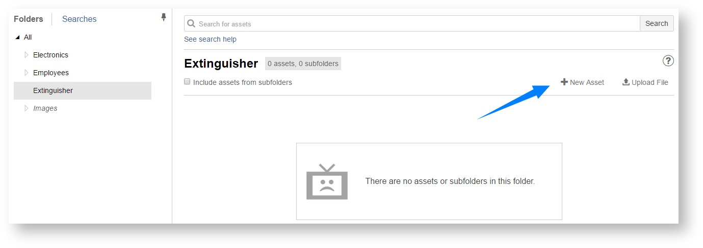
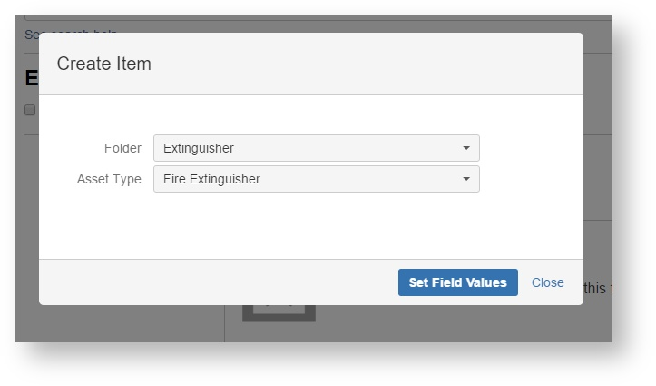
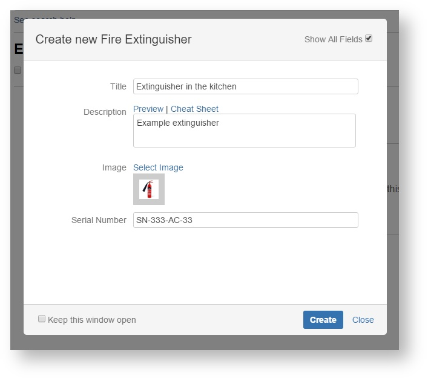

# Creating an asset

Every time you buy a new chair or computer you need to create new item that represents it in Asset Tracker. 

  
Let's assume that you bought a new foam extinguisher and you want to create new asset representing it in Asset Tracker. To do that just click the "New asset" button.

On the popup that will appear select "Asset Type" equals "Fire Extinguisher" and leave default "Folder". Then click "Set Field Values" to go to next screen.

Type title and description for new item. Click "Show All Fields" check box and enter serial number of your extinguisher. Then click "Create" button.

