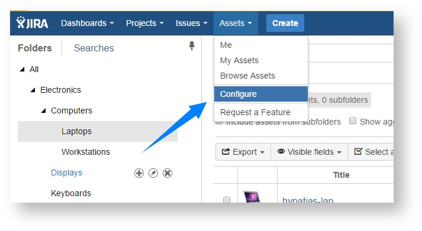
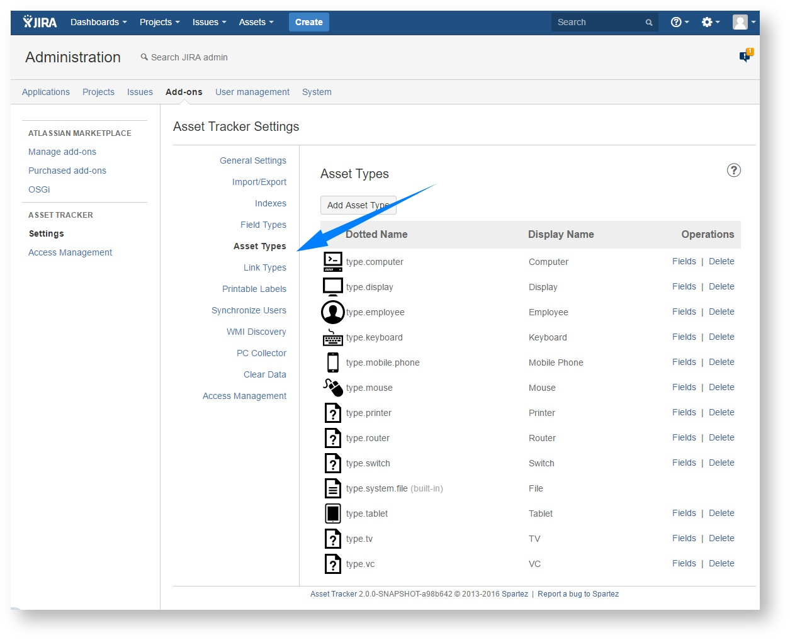
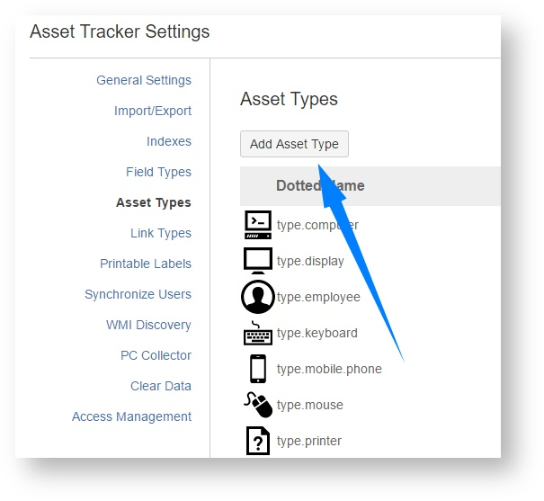
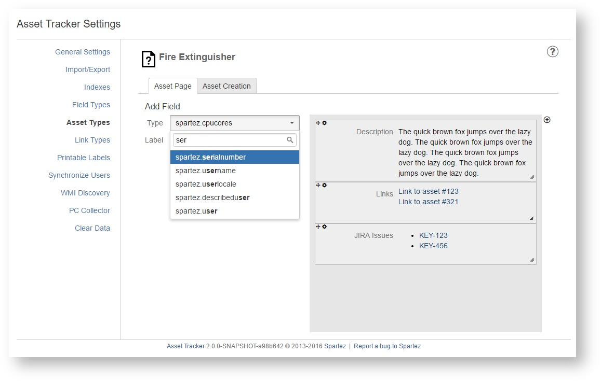
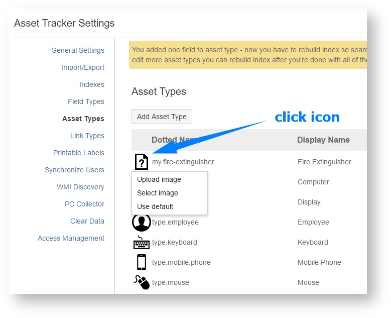

# Creating new asset type

Let's say you want to manage a new type of assets in your Asset Tracker instance. In this example it will be **fire extinguisher**, because they have to be managed in every office.

First you have to define new asset type. It is very simple!

### Go to Asset Types section in administration

### Add an asset type

Set its dotted name and display name \(in our case "my.fire-extinguisher" and "Fire Extinguisher"\). Dotted name is an identifier of asset type and must be unique.

### Add asset type fields  

For now, we will add one field only - serial number. To do it, simply select "spartez.serialnumber" from a dropdown on "Add Field" section and click "Add" button. 

### Set asset type icon

You can upload one from your computer or use one of already existing icons in Asset Tracker

