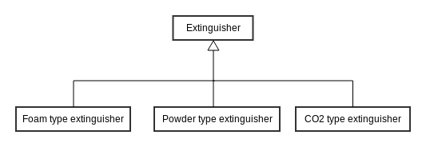
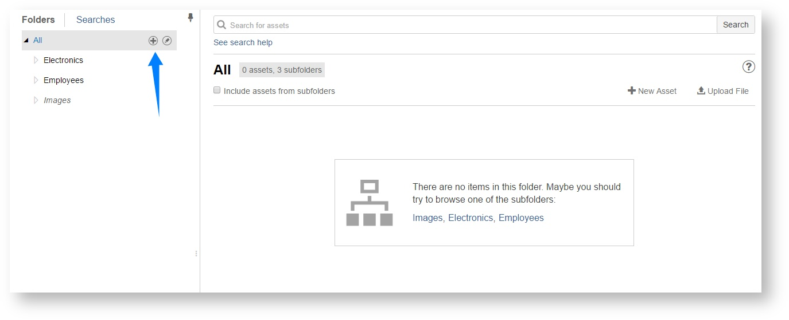
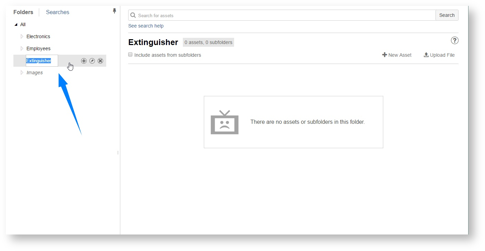

# Working with folders

Let's assume that you have three types of extinguishers in your company:

* foam type extinguishers,
* powder type extinguishers,
* CO2  type extinguishers.

The best way to keep them in Asset Tracker is to have a folder tree similar to the one on diagram below:

It is very simple to create such a structure in Asset Tracker. Just go to the assets list screen, hover "All" folder and click "+" icon that will appear next to it \(see the screenshot below\).

Enter a name of new folder \("Extinguisher"\) and that's it! You can now create subfolders for each type of extinguishers.

